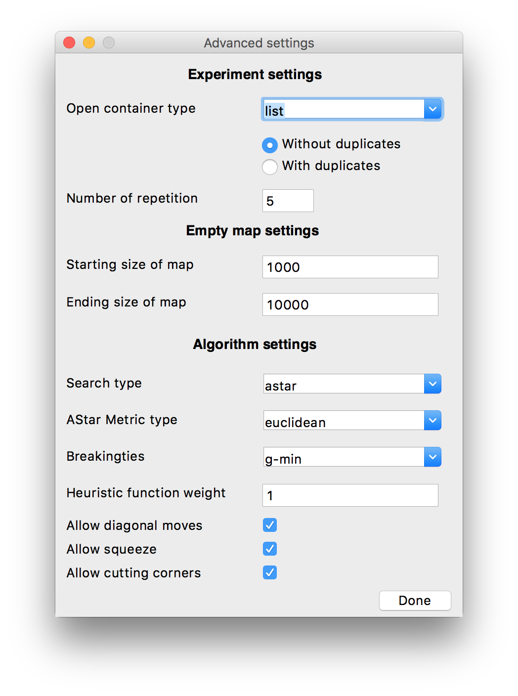

# ASearchTestUtility

A small utility for testing of [AStar-DCO](https://github.com/haiot4105/PathSearching) with different input data

## Description

 This utility allows to simplify the process of collecting data about the speed of the algorithm implemented using various containers for the Open  set.

 In the main window you can select an executable file and the type of input data (You can use an empty map or a prepared file with map)

 In the advanced settings you can set up the input file tags (for more information about tags see Input and Output files section of [AStar-DCO repository](https://github.com/haiot4105/PathSearching)) and the number of runnings of one  same test. If you use an empty map, you can specify the initial and final size of the map. In this case, several tests will be performed with an empty map and the specified settings, and the map size will change in steps of 100 units from the initial size to the final one (The empty map has a square shape and the size indicates the length of its side. Start and finish are located on opposite corners of the map, and the path passes diagonally). 
 

## Requirements and Launch

To run the utility you need to have the following packages installed:

* tkinter
* xlwt

After installing run the below:

`python3 main.py`

For testing on your computer, it is recommended to close all programs except the utility and, if possible, stop the background processes

## Input and Output files

To start testing you need to compile [AStar-DCO project](https://github.com/haiot4105/PathSearching)and choose executable file in main windowAlso you can set up some paramethers in advanced settings. If you want to use your own map, you can choose your xml file. (for more information about it see Input and Output files section of [AStar-DCO repository](https://github.com/haiot4105/PathSearching)). For the correct start of testing, all file paths must not contain spaces. Utility generate excel table which includes information about runtime and save it to directory, where source files locate. If there are some errors in last columl of table, you need to find all `.` and replace to `,`

